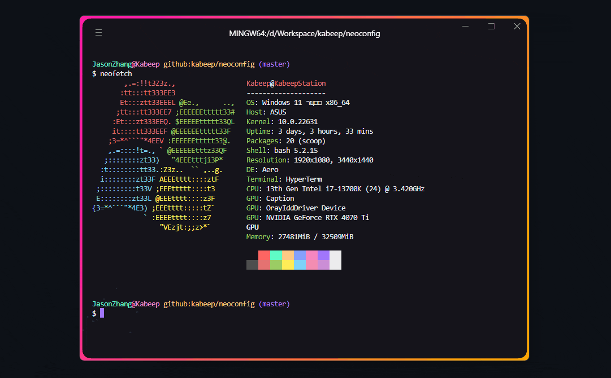

<div align="center">

<h1>NeoConfig</h1>

一个 Node.js 命令行工具用来管理 `NeoFetch` 配置文件。

[![NodeJS][node-image]][node-url]
[![Install Size][install-size-image]][install-size-url]
[![NPM][npm-image]][npm-url]
[![code style][code-style-image]][code-style-url]
[![License][license-image]][license-url]

[English][en-us-url] | 简体中文

![Insights][insights-image]



</div>

## 📖 简介

> [!TIP]
> 
> 默认 `themes` 是空目录，需要拖入自定义配置文件，也可以使用开源社区提供的配置文件，见下文关联库部分。

在命令行中切换 `NeoFetch` 自定义主题，通过预设配置文件在录屏和演示场景中快速切换。

## ⚙️ 先决条件

- 安装 [NeoFetch][neofetch-url]，如果没有它，这个包没有任何意义。

  1. NPM ([Node.js][node-url])
      ```bash
      npm i -g neofetch
      ```

  2. Windows
      ```bash
      scoop i -g neofetch
      ```

  3. MacOS
      ```bash
      brew i -g neofetch
      ```

- 使用支持 Unicode Symbols 字体的终端，以获得 `NeoFetch` 和 `NeoConfig` 的最佳使用体验

  (许多终端原生支持字体，如 zsh/CMD/PowerShell/JetBrain...，可以省略这一步骤)

> 也有些不支持或部分支持，LinuxOS、基于 `xterm-256color` 实现的命令行如 `Microsoft/VSCode`/`Vercel/Hyper`...
> 详见 https://github.com/xtermjs/xterm.js/issues/2693
>
> 此时需要自行下载字体，推荐 [Nerd Symbols Font][nerd-url]，它在命令行程序中使用更为广泛。
>
> 下载字体后仍需为命令行配置，拿 Windows 11 和 Hyper 举例，需要将字体文件安装到 `设置` > `个性化` > `字体` 中，然后在
> `Hyper` 配置文件的 `fontFamily` 中添加这一字体，`Sublime Text` 和 `VSCode` 也同理。

## 📦 安装

```bash
npm install --global @kabeep/neoconfig
```

```bash
yarn add --global @kabeep/neoconfig
```

```bash
pnpm add --global @kabeep/neoconfig
```

## 🚀 使用

#### \> 获取帮助信息_

```bash
neoconfig -h
```

```
neoconfig [选项]

选项：
  -h, --help     显示帮助信息                                             [布尔]
  -v, --version  显示版本号                                               [布尔]
```

#### \> 交互式配置_

```bash
neoconfig
```

```
? 请选择一个 neofetch 主题
❯ ⚙️ default.conf
  📁 large
  📁 small
  📁 termux
(使用箭头键)
------------------
按 ▲  / ▼  移动光标
按 ► / ENTER 进入选定目录
按 ◄ 返回上级目录
按 ENTER 切换主题
按 CTRL - C 退出交互
```

#### > 查看更多_

[![asciicast][asciinema-image]][asciinema-url]

## 📄 支持目录结构

```
~/.config/neofetch               # 根目录
├── config.conf                  # 当前配置文件
└── themes                       # 固定主题目录
    ├── default.conf             # 单配置文件
    └── large                    # 配置文件分组 (不限制目录名称/嵌套深度)
        ├── myTheme1             # 自定义配置文件
        │   ├── ascii.txt        # ASCII 字符画
        │   └── config.conf      # 配置文件
        └── myTheme2             # 嵌套的自定义配置文件
            ├── config.conf      # 配置文件
            └── assets           # 配置文件引用资产 (不限制目录名称/嵌套深度)
                └── ascii.txt    # ASCII 字符画
```

## 🌐 国际化

| 语言名称               | 本地名称 | ISO-639-1 | ISO-3166-1 (Alpha-2) | 文件                           |
|:-------------------|:----:|:---------:|:--------------------:|:-----------------------------|
| English            |  -   |    en     |          US          | [en-US.ts][locale-en-us-url] |
| Chinese Simplified | 简体中文 |    zh     |          CN          | [zh-CN.ts][locale-zh-cn-url] |

## 🔗 关联库

- [neofetch-themes][neofetch-themes-url] - NeoFetch 配置文件合集。
- [NeoCat][neocat-url] - NeoFetch 主题包。

## 🤝 贡献

欢迎通过 Pull Requests 或 [Issues][issues-url] 来贡献你的想法和代码。

## 📄 许可

本项目采用 MIT 许可证。详情请见 [LICENSE][license-url] 文件。


[insights-image]: https://repobeats.axiom.co/api/embed/788ba6ff3ebd97d768044c0e5d43fcb483faf843.svg

[node-image]: https://img.shields.io/node/v/%40kabeep%2Fneoconfig?color=lightseagreen
[node-url]: https://nodejs.org/

[npm-image]: https://img.shields.io/npm/d18m/%40kabeep%2Fneoconfig?color=fa6673
[npm-url]: https://www.npmjs.com/package/@kabeep/neoconfig

[install-size-image]: https://packagephobia.com/badge?p=@kabeep/neoconfig
[install-size-url]: https://packagephobia.com/result?p=@kabeep/neoconfig

[code-style-image]: https://img.shields.io/badge/Formatted_with-Biome-cornflowerblue?style=flat&logo=biome
[code-style-url]: https://biomejs.dev/

[asciinema-image]: https://asciinema.org/a/697466.svg
[asciinema-url]: https://asciinema.org/a/697466

[license-image]: https://img.shields.io/github/license/kabeep/neoconfig?color=slateblue
[license-url]: LICENSE

[en-us-url]: README.md
[zh-cn-url]: README.zh-CN.md

[locale-en-us-url]: src/locale/en-US.ts
[locale-zh-cn-url]: src/locale/zh-CN.ts

[neofetch-url]: https://github.com/dylanaraps/neofetch
[nerd-url]: https://www.nerdfonts.com/font-downloads
[neofetch-themes-url]: https://github.com/Chick2D/neofetch-themes
[neocat-url]: https://github.com/m3tozz/NeoCat

[issues-url]: https://github.com/kabeep/neoconfig/issues
